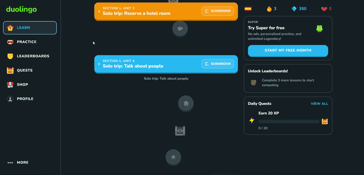
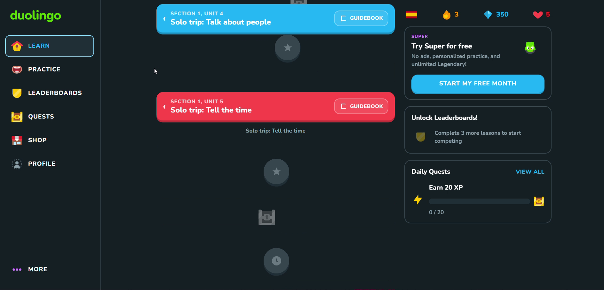
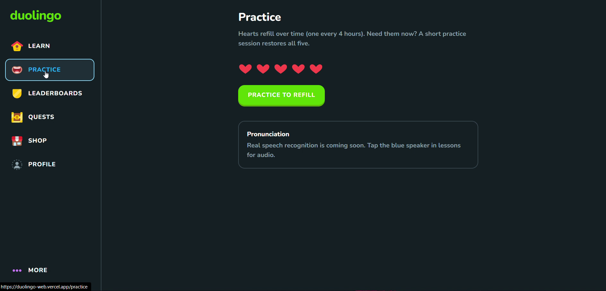
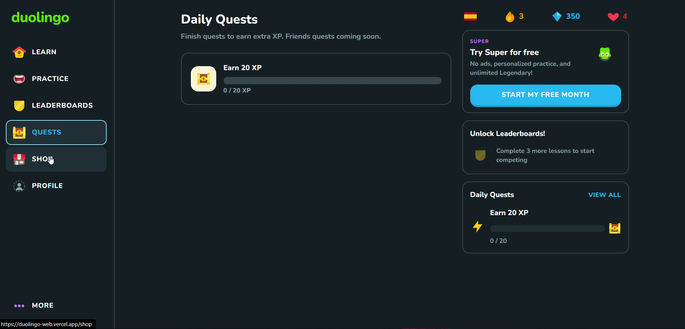
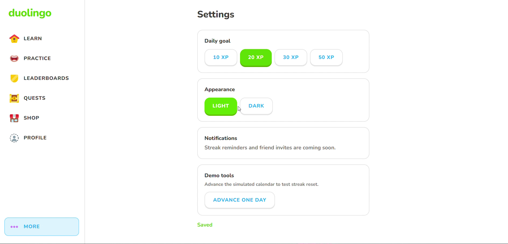

<div align="center">

# 🦉 Duolingo Web Clone

**A modern, production-grade replica of Duolingo's web learning experience.**  
*Featuring gamified lessons, interactive winding paths, audio speech synthesis, and real-time state management.*

<br/>

[](https://nextjs.org/)
[](https://fastapi.tiangolo.com/)
[](https://www.typescriptlang.org/)
[](https://tailwindcss.com/)
[](https://www.sqlite.org/)

<br/>

<!-- ANIMATED DEMO SHOWCASE -->
<p align="center">
  
</p>

🎬 **[Watch Full High-Definition Demo Video (MP4)](assets/demo.mp4)**

</div>

---

## 📸 Interface Gallery

<div align="center">
<table>
  <tr>
    <td width="50%">
      <h4 align="center">🗺️ Interactive Learning Path</h4>
      
    </td>
    <td width="50%">
      <h4 align="center">✍️ Interactive Exercise Player</h4>
      
    </td>
  </tr>
  <tr>
    <td width="50%">
      <h4 align="center">🏆 League Leaderboard</h4>
      
    </td>
    <td width="50%">
      <h4 align="center">👤 Learner Profile & Achievements</h4>
      
    </td>
  </tr>
</table>
</div>

---

## ✨ Key Features

- **🎮 Gamified Learning Loop**:
  - **Hearts System**: 5-heart energy constraint with 4-hour automatic regeneration or instant practice refill.
  - **Streaks & XP**: Append-only XP tracking with daily goals and multi-day streak calculations.
  - **Crowns & Mastery**: Progressive skill mastery stages (0–5 crowns) unlocking legendary challenges.
- **🗺️ Interactive Path & Nodes**:
  - Dynamic snake/winding SVG path with locked, active, and completed lesson nodes.
  - Animated bouncing Duo character tracking learner progress.
- **🧩 5 Dynamic Exercise Types**:
  - Multiple choice selection
  - Word bank sentence builder
  - Listening & translation
  - Matching pairs
  - Timed 90-second Legendary challenges (3-strike elimination)
- **🔊 Speech Synthesis**: Integrated Web Speech API for native, real-time Spanish pronunciation without external audio CDNs.
- **🛡️ Server-Authoritative State**: Lesson grading, XP awards, and heart calculations are executed securely on the server—preventing client-side tampering.

---

## 🛠️ Tech Stack & Architecture

```
┌─────────────────────────────────┐
│     Next.js App Router (UI)     │
│  TypeScript • Tailwind • Nunito │
└────────────────┬────────────────┘
                 │ /api/* proxy rewrite
                 ▼
┌─────────────────────────────────┐
│       Python FastAPI API        │
│   SQLAlchemy 2.0 • Pydantic     │
└────────────────┬────────────────┘
                 │
                 ▼
┌─────────────────────────────────┐
│         SQLite Database         │
│  Auto-seeded Courses & Progress │
└─────────────────────────────────┘
```

| Layer | Technology | Description |
| :--- | :--- | :--- |
| **Frontend** | **Next.js (App Router)** | Modern React server components, server actions, and responsive layout |
| **Styling** | **Tailwind CSS** | Duolingo's signature 3D playful buttons, bouncy micro-animations & vibrant tokens |
| **Backend** | **FastAPI** | High-performance Python REST API with automatic OpenAPI documentation |
| **ORM & DB** | **SQLAlchemy 2.0 + SQLite** | Structured relational schema with foreign key integrity and CHECK constraints |
| **Audio** | **Web Speech API** | Native in-browser speech synthesis for pronunciation |

---

## 🚀 Quick Start Guide

### Prerequisites
- **Node.js** (v18.0 or newer)
- **Python** (v3.10 or newer)
- **Git**

---

### 1. Clone & Set Up Backend

```bash
# Navigate to backend directory
cd backend

# Create and activate virtual environment
python -m venv .venv

# On Windows:
.venv\Scripts\activate

# On macOS/Linux:
source .venv/bin/activate

# Install dependencies
pip install -r requirements.txt

# Start the FastAPI server (runs on port 8000)
uvicorn app.main:app --reload --port 8000
```
> 💡 *The SQLite database (`backend/app.db`) is automatically created and seeded with Spanish courses and rival learners on first startup.*  
> 📖 *Explore the interactive API docs at [http://127.0.0.1:8000/docs](http://127.0.0.1:8000/docs).*

---

### 2. Set Up Frontend

In a new terminal window:

```bash
# Navigate to frontend directory
cd frontend

# Install dependencies
npm install

# Run development server
npm run dev
```

Open **[http://localhost:3000](http://localhost:3000)** in your browser to start learning! 🚀

---

## 🗄️ Database Schema & Data Models

- **`users`**: Manages XP, streak, gems, hearts (0–5), last activity timestamp, and daily goals.
- **`courses` / `units` / `skills` / `lessons` / `exercises`**: Structured hierarchy supporting polymorphic question payloads.
- **`lesson_sessions`**: Ephemeral in-flight session states guarding grading, heart loss, and XP verification.
- **`user_skill_progress`**: Tracks crown progression and legendary unlocks per skill.
- **`xp_events`**: Append-only log calculating daily velocity and leaderboard standings.

---

## 🧪 Testing

Run backend tests using `pytest`:

```bash
cd backend
python -m pytest -v
```

---

## 🤝 Contributing

Contributions, issues, and feature requests are welcome!  
Feel free to check out the [issues page](https://github.com/ajaygarg6666/duolingo-clone/issues).

---

<div align="center">
  <sub>Built with ❤️ by <a href="https://github.com/ajaygarg6666">Ajay Garg</a></sub>
</div>
